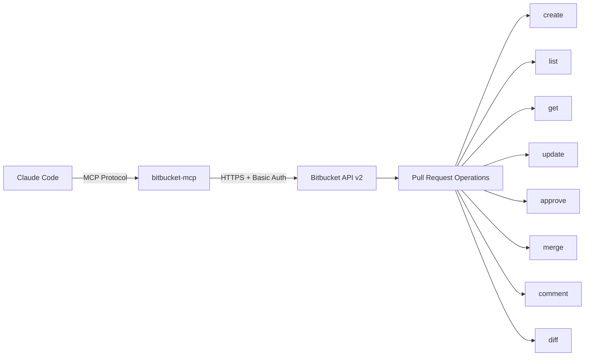
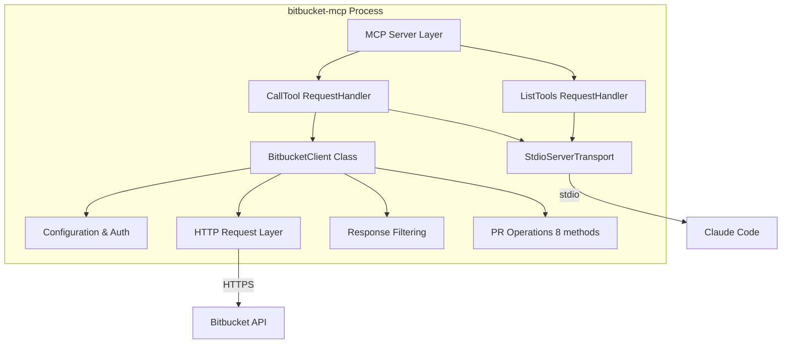

# bitbucket-mcp - C4 Architecture

MCP server enabling Claude Code to manage Bitbucket pull requests via REST API v2.0.

## Level 1: System Context

The bitbucket-mcp server acts as a bridge between Claude Code and Bitbucket API.

### ASCII Diagram

```
┌─────────────────────────────────────────────────────────────────┐
│                         Claude Code                              │
│                      (AI Assistant)                              │
└─────────────────────────────────────┬───────────────────────────┘
                                      │
                   ┌───────────────────┴───────────────────┐
                   │      MCP Protocol (stdio/JSON-RPC)    │
                   └───────────────────┬───────────────────┘
                                       │
                   ┌───────────────────▼───────────────────┐
                   │         bitbucket-mcp Server          │
                   │          (index.ts + client)          │
                   └───────────────────┬───────────────────┘
                                       │
                   ┌───────────────────▼───────────────────┐
                   │        Bitbucket REST API v2          │
                   │       HTTPS + Basic Auth              │
                   │    api.bitbucket.org/2.0              │
                   └───────────────────┬───────────────────┘
                                       │
                   ┌───────────────────▼───────────────────┐
                   │         Pull Request Operations       │
                   │  create / list / get / update          │
                   │  approve / merge / comment / diff      │
                   └───────────────────────────────────────┘
```

### Mermaid Diagram



### External Systems

| System | Description | Protocol |
|--------|-------------|----------|
| Claude Code | AI coding assistant | MCP (stdio) |
| Bitbucket API | REST API v2.0 | HTTPS + Basic Auth |

## Level 2: Container

The bitbucket-mcp server is a Node.js process that communicates via stdio.

### ASCII Diagram

```
┌─────────────────────────────────────────────────────────────────┐
│                     bitbucket-mcp Process                        │
│                        (Node.js Runtime)                         │
├─────────────────────────────────────────────────────────────────┤
│                                                                   │
│  ┌─────────────────────────────────────────────────────────┐    │
│  │                   MCP Server Layer                       │    │
│  │  ┌─────────────────┐    ┌─────────────────────────┐     │    │
│  │  │ ListTools       │    │   CallTool             │     │    │
│  │  │ RequestHandler  │    │   RequestHandler       │     │    │
│  │  │                 │    │                         │     │    │
│  │  │ 8 tools:        │    │ switch(tool) → method   │     │    │
│  │  │ - create_pr     │    │                         │     │    │
│  │  │ - get_pr        │    │                         │     │    │
│  │  │ - list_prs      │    │                         │     │    │
│  │  │ - update_pr     │    │                         │     │    │
│  │  │ - approve_pr    │    │                         │     │    │
│  │  │ - merge_pr      │    │                         │     │    │
│  │  │ - add_comment   │    │                         │     │    │
│  │  │ - get_diff      │    │                         │     │    │
│  │  └─────────────────┘    └─────────────────────────┘     │    │
│  └─────────────────────────────────────────────────────────┘    │
│                              │                                    │
│  ┌───────────────────────────▼─────────────────────────────┐    │
│  │                  BitbucketClient Class                    │    │
│  │  ┌─────────────────────────────────────────────────┐    │    │
│  │  │ Configuration & Auth                              │    │    │
│  │  │ - apiToken: string                                │    │    │
│  │  │ - email: string                                   │    │    │
│  │  │ - authHeader: string (Basic)                      │    │    │
│  │  │ - constructor(): validate env vars                │    │    │
│  │  └─────────────────────────────────────────────────┘    │    │
│  │  ┌─────────────────────────────────────────────────┐    │    │
│  │  │ HTTP Request Layer (private)                      │    │    │
│  │  │ - request(endpoint, options) → Promise<T>         │    │    │
│  │  │   - Retry logic (MAX_RETRIES=3)                   │    │    │
│  │  │   - Rate limit handling (429)                     │    │    │
│  │  │   - Exponential backoff                           │    │    │
│  │  └─────────────────────────────────────────────────┘    │    │
│  │  ┌─────────────────────────────────────────────────┐    │    │
│  │  │ Response Filtering (private)                      │    │    │
│  │  │ - filterPRData(pr) → PullRequest                 │    │    │
│  │  │   - ~90% size reduction                           │    │    │
│  │  │   - Preserves full description                    │    │    │
│  │  └─────────────────────────────────────────────────┘    │    │
│  │  ┌─────────────────────────────────────────────────┐    │    │
│  │  │ PR Operations (8 public methods)                  │    │    │
│  │  │ - createPR(params) → PullRequest                  │    │    │
│  │  │ - getPR(workspace, repo, id) → PullRequest        │    │    │
│  │  │ - listPRs(workspace, repo, state?) → PR[]         │    │    │
│  │  │ - updatePR(...) → PullRequest                     │    │    │
│  │  │ - approvePR(...) → void                           │    │    │
│  │  │ - mergePR(..., strategy?) → void                  │    │    │
│  │  │ - addComment(..., content) → void                 │    │    │
│  │  │ - getDiff(...) → string                           │    │    │
│  │  └─────────────────────────────────────────────────┘    │    │
│  └─────────────────────────────────────────────────────────┘    │
│                              │                                    │
│  ┌───────────────────────────▼─────────────────────────────┐    │
│  │              StdioServerTransport                        │    │
│  │          (JSON-RPC over stdin/stdout)                    │    │
│  └─────────────────────────────────────────────────────────┘    │
│                                                                   │
└───────────────────────────────────────────────────────────────────┘
                                    │
                                    ▼
                         ┌─────────────────────┐
                         │   Bitbucket API     │
                         │  api.bitbucket.org  │
                         └─────────────────────┘
```

### Mermaid Diagram



### Container Details

| Component | Technology | Purpose |
|-----------|-----------|---------|
| MCP Server | @modelcontextprotocol/sdk | Handles MCP protocol |
| Transport | StdioServerTransport | JSON-RPC over stdio |
| HTTP Client | node-fetch | Bitbucket API calls |

## Level 3: Component

Internal components and their interactions.

### BitbucketClient Class

```
┌─────────────────────────────────────────────────────────────────┐
│                       BitbucketClient                            │
├─────────────────────────────────────────────────────────────────┤
│                                                                   │
│  Properties:                                                      │
│  ┌─────────────────────────────────────────────────────────┐    │
│  │  apiToken: string                                        │    │
│  │  email: string                                           │    │
│  │  authHeader: string (Basic base64)                       │    │
│  └─────────────────────────────────────────────────────────┘    │
│                                                                   │
│  Private Methods:                                                 │
│  ┌─────────────────────────────────────────────────────────┐    │
│  │  request<T>(endpoint, options) → Promise<T>             │    │
│  │    - Retry logic (3 attempts)                            │    │
│  │    - 429 rate limit handling                             │    │
│  │    - Retry-After header parsing                          │    │
│  │    - Exponential backoff                                 │    │
│  │                                                             │    │
│  │  filterPRData(pr) → PullRequest                           │    │
│  │    - Removes nested values (90% size reduction)           │    │
│  │    - Preserves full description/summary                   │    │
│  │                                                             │    │
│  │  sleep(ms) → Promise<void>                                │    │
│  └─────────────────────────────────────────────────────────┘    │
│                                                                   │
│  Public PR Operations:                                            │
│  ┌─────────────────────────────────────────────────────────┐    │
│  │  createPR(params) → PullRequest                          │    │
│  │    POST /repositories/{ws}/{repo}/pullrequests           │    │
│  │                                                             │    │
│  │  getPR(workspace, repoSlug, prId) → PullRequest          │    │
│  │    GET /repositories/{ws}/{repo}/pullrequests/{id}        │    │
│  │                                                             │    │
│  │  listPRs(workspace, repoSlug, state?) → PullRequest[]    │    │
│  │    GET /repositories/{ws}/{repo}/pullrequests?state=      │    │
│  │                                                             │    │
│  │  updatePR(workspace, repoSlug, prId, updates) → PR        │    │
│  │    PUT /repositories/{ws}/{repo}/pullrequests/{id}        │    │
│  │                                                             │    │
│  │  approvePR(workspace, repoSlug, prId) → void             │    │
│  │    POST /repositories/{ws}/{repo}/pullrequests/{id}/approve│    │
│  │                                                             │    │
│  │  mergePR(workspace, repoSlug, prId, strategy?) → void    │    │
│  │    POST /repositories/{ws}/{repo}/pullrequests/{id}/merge │    │
│  │                                                             │    │
│  │  addComment(workspace, repoSlug, prId, content) → void   │    │
│  │    POST /repositories/{ws}/{repo}/pullrequests/{id}/comments│    │
│  │                                                             │    │
│  │  getDiff(workspace, repoSlug, prId) → string             │    │
│  │    GET /repositories/{ws}/{repo}/pullrequests/{id}/diff   │    │
│  └─────────────────────────────────────────────────────────┘    │
│                                                                   │
└───────────────────────────────────────────────────────────────────┘
```

### Data Flow

```
Claude Code                    MCP Server                   Bitbucket API
     │                              │                            │
     │  ──── create_pr ──────────>│                            │
     │                              │  ──── POST /pullrequests >│
     │                              │                            │
     │                              │  <─── 201 + PR data ────── │
     │  <─── PR created ───────────│                            │
     │                              │                            │
```

### Data Models

```typescript
interface PullRequest {
  id: number;
  title: string;
  description: string;
  state: "OPEN" | "MERGED" | "DECLINED" | "SUPERSEDED";
  source: { branch: { name: string } };
  destination: { branch: { name: string } };
  author?: { display_name: string; uuid: string };
  created_on?: string;
  updated_on?: string;
  links?: { html: { href: string } };
}

interface CreatePRParams {
  workspace: string;
  repoSlug: string;
  title: string;
  description: string;
  sourceBranch: string;
  destinationBranch: string;
}

interface UpdatePRParams {
  title?: string;
  description?: string;
}
```

## Level 4: Code

File structure and key implementation details.

### Project Structure

```
bitbucket-mcp/
├── src/
│   ├── index.ts           # MCP server entry point (~465 LOC)
│   └── bitbucket-client.ts # Bitbucket API client (~315 LOC)
├── dist/                  # Compiled output
├── package.json
├── tsconfig.json
├── .env.example
└── README.md
```

### Key Constants

```typescript
const API_BASE_URL = "https://api.bitbucket.org/2.0";
const MAX_RETRIES = 3;
const RETRY_DELAY_MS = 1000;
```

### Environment Variables

| Variable | Required | Description |
|----------|----------|-------------|
| BITBUCKET_API_TOKEN | Yes | API token with PR scopes |
| BITBUCKET_EMAIL | Yes | Atlassian account email |

### Authentication

```typescript
const credentials = Buffer.from(`${email}:${apiToken}`).toString('base64');
const authHeader = `Basic ${credentials}`;
```

### Tool List

| Tool | Description | Required Parameters |
|------|-------------|---------------------|
| create_pr | Create pull request | workspace, repoSlug, title, description, sourceBranch, destinationBranch |
| get_pr | Get PR details | workspace, repoSlug, prId |
| list_prs | List PRs with filter | workspace, repoSlug, state? |
| update_pr | Update PR title/description | workspace, repoSlug, prId, title?, description? |
| approve_pr | Approve PR | workspace, repoSlug, prId |
| merge_pr | Merge PR | workspace, repoSlug, prId, strategy? |
| add_comment | Add comment to PR | workspace, repoSlug, prId, content |
| get_diff | Get PR diff | workspace, repoSlug, prId |

### Dependencies

| Package | Version | Purpose |
|---------|---------|---------|
| @modelcontextprotocol/sdk | ^1.0.0 | MCP protocol |
| node-fetch | ^3.3.0 | HTTP requests |
| dotenv | ^16.3.0 | Environment config |
| typescript | ^5.3.0 | Compiler |

### Error Handling

| Status | Action |
|--------|--------|
| 401 | Invalid credentials |
| 403 | Insufficient permissions |
| 404 | Resource not found |
| 409 | Conflict (already merged) |
| 429 | Rate limit - retry after delay |
| 5xx | Retry with backoff |
