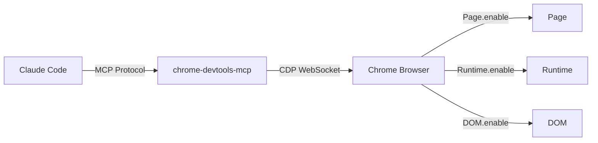
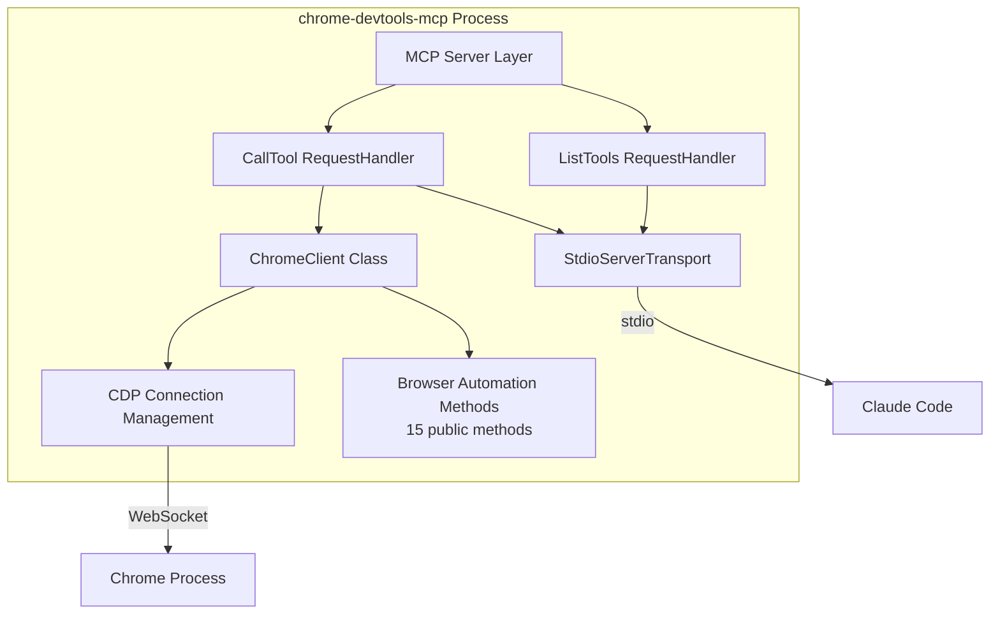

# chrome-devtools-mcp - C4 Architecture

MCP server enabling Claude Code to automate Chrome browser via Chrome DevTools Protocol (CDP).

## Level 1: System Context

The chrome-devtools-mcp server acts as a bridge between Claude Code and Chrome browser.

### ASCII Diagram

```
┌─────────────────────────────────────────────────────────────────┐
│                         Claude Code                              │
│                      (AI Assistant)                              │
└─────────────────────────────────────┬───────────────────────────┘
                                      │
                   ┌───────────────────┴───────────────────┐
                   │      MCP Protocol (stdio/JSON-RPC)    │
                   └───────────────────┬───────────────────┘
                                       │
                   ┌───────────────────▼───────────────────┐
                   │       chrome-devtools-mcp Server      │
                   │          (index.ts + client)          │
                   └───────────────────┬───────────────────┘
                                       │
                   ┌───────────────────▼───────────────────┐
                   │     Chrome DevTools Protocol (CDP)    │
                   │          WebSocket (localhost:9222)   │
                   └───────────────────┬───────────────────┘
                                       │
                   ┌───────────────────▼───────────────────┐
                   │            Chrome Browser             │
                   │         (Page / Runtime / DOM)        │
                   └───────────────────────────────────────┘
```

### Mermaid Diagram



### External Systems

| System | Description | Protocol |
|--------|-------------|----------|
| Claude Code | AI coding assistant | MCP (stdio) |
| Chrome Browser | Web browser | CDP (WebSocket) |

## Level 2: Container

The chrome-devtools-mcp server is a Node.js process that communicates via stdio.

### ASCII Diagram

```
┌─────────────────────────────────────────────────────────────────┐
│                    chrome-devtools-mcp Process                   │
│                        (Node.js Runtime)                         │
├─────────────────────────────────────────────────────────────────┤
│                                                                   │
│  ┌─────────────────────────────────────────────────────────┐    │
│  │                   MCP Server Layer                       │    │
│  │  ┌─────────────────┐    ┌─────────────────────────┐     │    │
│  │  │ ListTools       │    │   CallTool             │     │    │
│  │  │ RequestHandler  │    │   RequestHandler       │     │    │
│  │  │                 │    │                         │     │    │
│  │  │ 15 tools:       │    │ switch(tool) → method   │     │    │
│  │  │ - screenshot    │    │                         │     │    │
│  │  │ - click         │    │                         │     │    │
│  │  │ - type          │    │                         │     │    │
│  │  │ - navigate      │    │                         │     │    │
│  │  │ - evaluate      │    │                         │     │    │
│  │  │ - scroll        │    │                         │     │    │
│  │  │ ... (9 more)    │    │                         │     │    │
│  │  └─────────────────┘    └─────────────────────────┘     │    │
│  └─────────────────────────────────────────────────────────┘    │
│                              │                                    │
│  ┌───────────────────────────┼─────────────────────────────┐    │
│  │                   ChromeClient Class                     │    │
│  │  ┌─────────────────────────────────────────────────┐    │    │
│  │  │ CDP Connection Management                        │    │    │
│  │  │ - connect(targetId?)                             │    │    │
│  │  │ - ensureChromeRunning()                          │    │    │
│  │  │ - launchChrome(url?, profile?)                   │    │    │
│  │  └─────────────────────────────────────────────────┘    │    │
│  │  ┌─────────────────────────────────────────────────┐    │    │
│  │  │ Browser Automation Methods (15 public)           │    │    │
│  │  │ - screenshot(), click(), type(), navigate()       │    │    │
│  │  │ - evaluate(), getContent(), listTabs()            │    │    │
│  │  │ - scroll(), mouseMove(), drag(), sendKey()        │    │    │
│  │  │ - waitFor(), switchTab(), canvasZoom()            │    │    │
│  │  └─────────────────────────────────────────────────┘    │    │
│  └─────────────────────────────────────────────────────────┘    │
│                              │                                    │
│  ┌───────────────────────────▼─────────────────────────────┐    │
│  │              StdioServerTransport                        │    │
│  │          (JSON-RPC over stdin/stdout)                    │    │
│  └─────────────────────────────────────────────────────────┘    │
│                                                                   │
└───────────────────────────────────────────────────────────────────┘
                                    │
                                    ▼
                         ┌─────────────────────┐
                         │   Chrome Process    │
                         │   localhost:9222    │
                         └─────────────────────┘
```

### Mermaid Diagram



### Container Details

| Component | Technology | Purpose |
|-----------|-----------|---------|
| MCP Server | @modelcontextprotocol/sdk | Handles MCP protocol |
| Transport | StdioServerTransport | JSON-RPC over stdio |
| CDP Client | chrome-remote-interface | Chrome automation |

## Level 3: Component

Internal components and their interactions.

### ChromeClient Class

```
┌─────────────────────────────────────────────────────────────────┐
│                        ChromeClient                              │
├─────────────────────────────────────────────────────────────────┤
│                                                                   │
│  Properties:                                                      │
│  ┌─────────────────────────────────────────────────────────┐    │
│  │  client: Client | null                                   │    │
│  │  currentTargetId: string | null                           │    │
│  └─────────────────────────────────────────────────────────┘    │
│                                                                   │
│  Connection Management:                                           │
│  ┌─────────────────────────────────────────────────────────┐    │
│  │  connect(targetId?) → Promise<void>                      │    │
│  │  ensureChromeRunning() → Promise<void>                   │    │
│  │  launchChrome(url?, profile?) → Promise<string>          │    │
│  │  ensureConnected() → Promise<Client>                     │    │
│  └─────────────────────────────────────────────────────────┘    │
│                                                                   │
│  Tab Management:                                                  │
│  ┌─────────────────────────────────────────────────────────┐    │
│  │  listTabs() → Promise<TabInfo[]>                        │    │
│  │  switchTab(tabId) → Promise<void>                        │    │
│  └─────────────────────────────────────────────────────────┘    │
│                                                                   │
│  Page Interaction:                                                │
│  ┌─────────────────────────────────────────────────────────┐    │
│  │  navigate(url) → Promise<void>                           │    │
│  │  screenshot() → Promise<string>                          │    │
│  │  getContent(format) → Promise<string>                    │    │
│  │  evaluate(script) → Promise<T>                           │    │
│  └─────────────────────────────────────────────────────────┘    │
│                                                                   │
│  Element Interaction:                                             │
│  ┌─────────────────────────────────────────────────────────┐    │
│  │  click({selector?, x?, y?}) → Promise<void>              │    │
│  │  type(text, selector?) → Promise<void>                   │    │
│  │  waitFor(selector, timeout?) → Promise<void>             │    │
│  └─────────────────────────────────────────────────────────┘    │
│                                                                   │
│  Mouse & Keyboard:                                                │
│  ┌─────────────────────────────────────────────────────────┐    │
│  │  mouseMove(x, y) → Promise<void>                         │    │
│  │  drag(startX, startY, endX, endY) → Promise<void>        │    │
│  │  sendKey(key, modifiers?) → Promise<void>                │    │
│  └─────────────────────────────────────────────────────────┘    │
│                                                                   │
│  Advanced:                                                        │
│  ┌─────────────────────────────────────────────────────────┐    │
│  │  scroll(direction, amount?) → Promise<string>            │    │
│  │  canvasZoom(zoomIn?, amount?) → Promise<string>          │    │
│  └─────────────────────────────────────────────────────────┘    │
│                                                                   │
│  Private Helpers:                                                 │
│  ┌─────────────────────────────────────────────────────────┐    │
│  │  tryWheelScroll() → Promise<{success}>                   │    │
│  │  tryDomScroll() → Promise<{success, element}>            │    │
│  │  waitForTab() → Promise<void>                            │    │
│  │  sleep(ms) → Promise<void>                               │    │
│  └─────────────────────────────────────────────────────────┘    │
│                                                                   │
└───────────────────────────────────────────────────────────────────┘
```

### Data Flow

```
Claude Code                    MCP Server                     Chrome
     │                              │                            │
     │  ──── Tool Request ────────>│                            │
     │                              │  ──── CDP Command ─────>  │
     │                              │                            │
     │                              │  <─── CDP Response ────── │
     │  <─── Tool Response ─────────│                            │
     │                              │                            │
```

### Data Models

```typescript
interface TabInfo {
  id: string;
  title: string;
  url: string;
  type: string;
}
```

## Level 4: Code

File structure and key implementation details.

### Project Structure

```
chrome-devtools-mcp/
├── src/
│   ├── index.ts           # MCP server entry point (~520 LOC)
│   └── chrome-client.ts   # CDP connection manager (~715 LOC)
├── dist/                  # Compiled output
├── package.json
├── tsconfig.json
└── README.md
```

### Key Constants

```typescript
const CDP_HOST = "localhost";
const CDP_PORT = 9222;
const MAX_RETRIES = 3;
const RETRY_DELAY_MS = 1000;
const CHROME_LAUNCH_WAIT_MS = 2000;
const CDP_POLL_INTERVAL_MS = 100;
```

### Tool List

| Tool | Description | Parameters |
|------|-------------|------------|
| launch_chrome | Launch Chrome with debug port | url?, profile? |
| screenshot | Capture screenshot (base64 PNG) | - |
| click | Click element or coordinates | selector?, x?, y? |
| type | Type text into element | text, selector? |
| navigate | Navigate to URL | url |
| evaluate | Execute JavaScript | script |
| get_content | Get page text/HTML | format |
| list_tabs | List all tabs | - |
| switch_tab | Switch to tab | tabId |
| scroll | Smart scroll (wheel + DOM) | direction, amount? |
| mouse_move | Move mouse to coordinates | x, y |
| drag_and_drop | Drag from A to B | startX, startY, endX, endY |
| smart_type | Type with modifiers | key, modifiers? |
| wait_for | Wait for element | selector, timeout? |
| canvas_zoom | Zoom on canvas apps | zoomIn?, amount? |

### Dependencies

| Package | Version | Purpose |
|---------|---------|---------|
| @modelcontextprotocol/sdk | ^1.0.0 | MCP protocol |
| chrome-remote-interface | ^0.12.0 | CDP client |
| typescript | ^5.3.0 | Compiler |
